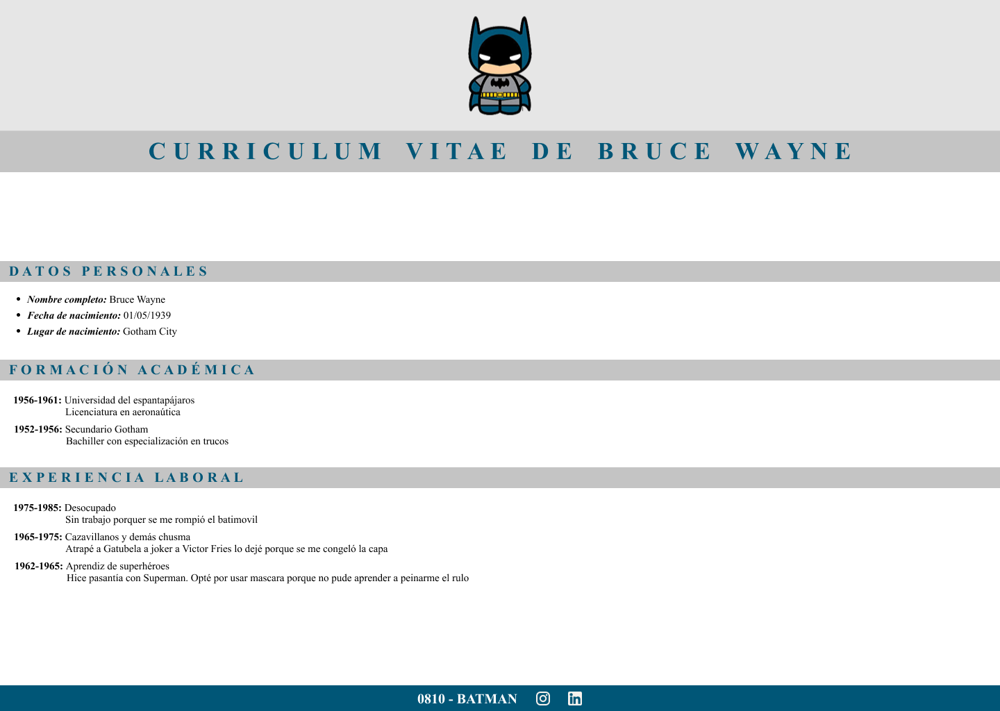

# Práctica Integradora C5S - Curso Frontend 1

## Programa *Certified Tech Developer* por [Digital House](https://www.digitalhouse.com)

En esta práctica se requiere llegar lo más cercano posible a lo presentado en la siguiente imagen:  
 

### Pasos desarrollados:  

1. Se crea la estructura de carpetas y archivos.
2. Se descargan y guardan las imágenes a utilizar en la carpeta `imagenes`
3. Se crea la estructura simple HTML que se determina conforma lo necesario para armar el contenido solicitado.
4. Se crean las reglas CSS para cada sección:
   1. Header (logo y título principal)
   2. Datos principales (section)
   3. Formación académica y Experiencia laboral (section)
   4. Pie de página (footer)  

 

**Observación**  

La estructura tanto del HTML como del CSS se lleva a cabo sin el uso de clases y/o ID's, con el objetivo de hacerlo lo más simple posible. Aunque como "*buenas prácticas*", es recomendable hacer uso de clases por sobre el uso de etiquetas.